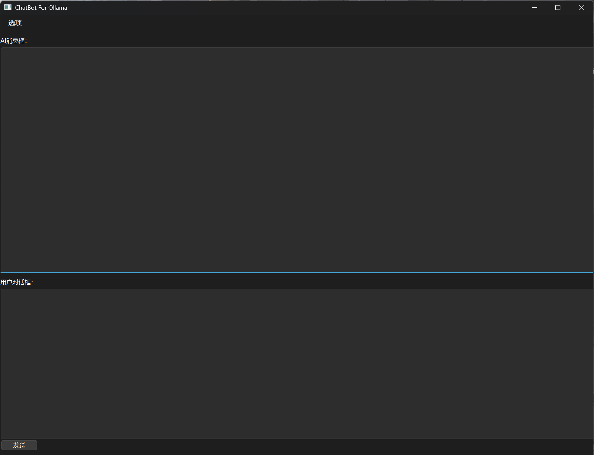
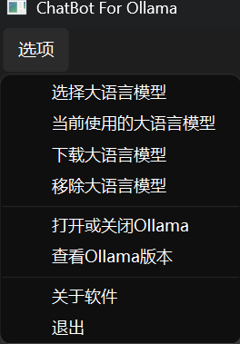

# ChatBot For Ollama By Python

你的人工AI智能助手（较为简便的图形化的Ollama前端客户端，目前支持Windows，但是后续将支持Linux平台）

## 介绍

通过Pyside6和langchain相关Python库来编写此软件。
本软件为Ollama前端客户端，支持模型搜索，下载，删除等管理，以及支持大语言模型当前对话。
该项目为练手项目，可供学习Qt开发（Python）的用户参考，会不定期更新版本。
该软件界面比较简陋，但是功能基本齐全，但任然存在一些问题：对话时等待AI对话回复过程中存在假死现象（后期本人在学习QThread，之后解决）；下载模型过程实现上比较简陋等问题。

## 安装教程

1、从源代码打包成exe（使用nuitka）：
    下载源码后解压，执行make.ps1的powershell脚本文件，执行完毕后从生成的output目录中就能找到生成的二进制文件啦！执行前请确认pip镜像速度稳定，构建过程中将会自动下载大量依赖，或者执行install-dependencies.ps1下载安装依赖

依赖如下：
    langchain>=0.1.20
    langchain-ollama
    langchain_core
    pyside6
    nuitka
    psutil

2、从Release下载打包好的二进制文件，直接运行即可

## 使用说明

作为Ollama前端客户端，您可以从菜单栏中选择操作并执行。如图：

下载界面会弹出ollama模型搜索官网

## 参与贡献

    欢迎有志者参与开发
